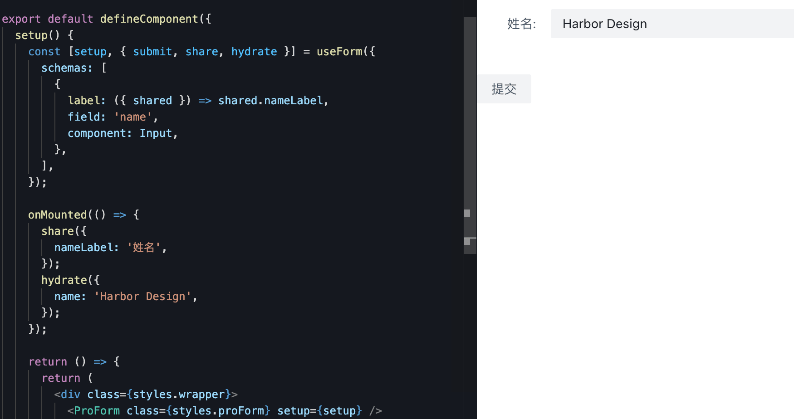

# useForm 函数

::: tip useForm
该函数用于初始化基本的 form 配置，其返回值形如 [setup,「Operations」]，「Operations」是一系列封装好的功能操作合集
:::

## 返回值介绍

### setup

setup 作为 useForm 函数的首个结果，在运行时会生成一些必要的元信息，但对于开发者来说，这些元信息是无需手动操作的，只需要交给 ProForm 组件去初始化表单即可

```tsx {4,16}
import { ProForm, useForm } from "@harbor-design/proform";
import { Input } from "@arco-design/web-vue";

const [setup, _] = useForm({
  schemas: [
    {
      label: "姓名",
      field: "name",
      component: Input,
    },
  ],
});

// render
render() {
  return <ProForm setup={setup} />
}
```

### 「Operations」

「Operations」是一个可持续迭代的业务工具包合集，此处对于业务的定义是对于表单业务的封装，例如常见的会有「submit - 提交」「hydrate - 数据回填」「share - 信息共享」等

```tsx {8,16,16-21}
import { ProForm, useForm } from "@harbor-design/proform";
import { Input } from "@arco-design/web-vue";

const [setup, _] = useForm({ // [!code --]
const [setup, { submit, hydrate, share }] = useForm({ // [!code ++]
  schemas: [
    {
      label: ({ shared }) => shared.nameLabel,
      field: "name",
      component: Input,
    },
  ],
});

onMounted(() => {
  share({
    nameLabel: "姓名"
  })
  hydrate({
    name: "Harbor Design"
  })
})

// render
render() {
  return <ProForm setup={setup} />
}
```

使用上述示例后，将得到下图的渲染效果，即通过 share 共享了 schema 中使用的 label，通过 hydrate 的方式向表单数据的 name 字段注入 Harbor Design


